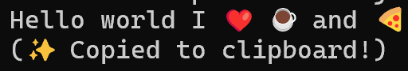

# Emojify

Emojify is a lightweight command-line interface (CLI) tool for converting plain text into emoji-enriched sentences.

* **Expressive:** Emojify makes it painless to add emotions to your text. Design simple mappings in JSON, and Emojify will efficiently update your sentences with the right emojis.
* **Data-Driven:** Build an extensive emoji dictionary without touching the code. Since mapping logic is separated into a JSON file, you can easily contribute new emojis and keep the logic clean.
* **Run Anywhere:** We don't make assumptions about your OS. As long as you have Java installed, you can run Emojify anywhere—from your local terminal to a server environment.
------------------------------------------------------------------
# Project Structure
```bash
│
├── src/
│   ├── main/
│   │   ├── java/org/emojify/      
│   │   │   ├── App.java      
│   │   │   ├── ConsoleInterface.java       
│   │   │   ├── EmojiDictionary.java      
│   │   │   └── Translator.java   
│   │   └── resources/      
│   │       ├── emoji_mapping.json       
│   │       ├── empty.json
│   │       └── simpleTestFile.json
│   └──test/
│       ├── Apptest.java      
│       ├── EmojiDictionaryTest.java     
│       └── TranslatorTest.java
├── images/
│   ├── main/
├── target/                   
├── .gitignore
├── CODE_OF_CONDUCT.md
├── CONTRIBUTING.md
├── LICENSE
├── pom.xml
└── README.md
```

------------------------------------------------------------------

## Installation

Emojify has been designed for ease of use from the start.

**Prerequisites:**
* Java JDK 21 or higher
* Maven

------------------------------------------------------------------

## How ro run the Project
You can run the main application with IntelliJ, via Maven orthe Jar
You should finish Build from source before running this Project.

From maven:
```bash
    mvn exec:java -Dexec.mainClass=org.emojify.App
```

From the compiled jar
```bash
java -jar target/EmojifyApp.jar
```

Execute unit tests to ensure everithing is working
```bash
mvn test
```

**Build from source:**

1.  Clone the repository:
    ```bash
    git clone https://github.com/saschahuberzh/Emojify.git
    ```
2.  Navigate to the project directory:
    ```bash
    cd Emojify
    ```
3.  Build the project using Maven:
    ```bash
    mvn clean package
    ```
4. Console encoding settings
    1. cmd : `chcp 65001`
    2. PowerShell : `$OutputEncoding = [System.Text.Encoding]::UTF8`


------------------------------------------------------------------

## Documentation

You can find the usage guide below.

* **Basic Usage:** Run the compiled jar file with a text string.
* **Customization:** Edit `src/main/resources/emoji_mapping.json` to add your own keywords.

## Examples

We have a simple example to get you started. Here is the command to run the tool:


```bash
java -jar target/EmojifyApp.jar
```


------------------------------------------------------------------

**Output:**

> I ❤️ ☕ and 🍕 (i love java and pizza)



You'll notice that keywords like **"Hello"**, **"love"**, **"java"**, and **"pizza"** were automatically translated.

------------------------------------------------------------------

## Contributing

The main purpose of this repository is to make text communication fun and standard. Development of **Emojify** happens in the open on GitHub, and we are grateful to the community for contributing bugfixes and new emoji data.

### 👮 Code of Conduct

We have adopted a **Code of Conduct** that we expect project participants to adhere to. We expect all contributors to use respectful language and avoid adding offensive emoji mappings.

### 🤝 Contributing Guide

* **Code:** If you are a developer, feel free to improve the `Translator` logic or add **Unit Tests**.
* **Data:** If you are new to coding, you can still help! Simply add new `"word": "emoji"` pairs to `src/main/resources/emoji_mapping.json` and submit a **Pull Request**.

### 🏷️ Good First Issues

To help you get your feet wet, we have a list of **Good First Issues** on our board. Adding new emojis to the JSON file is a great place to get started.

------------------------------------------------------------------

## 📝 License

Emojify is **MIT licensed**.
